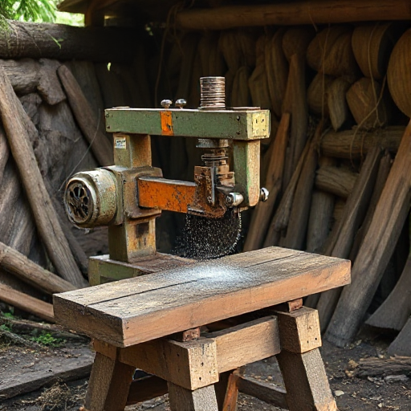

# 🌲 Stagex Africa Limited - Premium Timber & Woodworking Solutions

<div align="center">


**Your trusted partner in premium timber products and sustainable woodworking solutions**

[](https://nextjs.org/)
[](https://reactjs.org/)
[](https://www.typescriptlang.org/)
[](LICENSE)

[🌐 Live Website](https://stagexafrica.com/) • [📧 Contact Us](mailto:info@stagexafrica.com) • [📱 Call Us](tel:+254715196074)

</div>

---

## 📋 Table of Contents

- [About](#-about)
- [Services](#-services)
- [Features](#-features)
- [Technology Stack](#-technology-stack)
- [Getting Started](#-getting-started)
- [Project Structure](#-project-structure)
- [Team](#-team)
- [Screenshots](#-screenshots)
- [Sustainability](#-sustainability)
- [Contact Information](#-contact-information)
- [Contributing](#-contributing)
- [License](#-license)

---

## 🏢 About

**Stagex Africa Limited** is a premier timber and woodworking company established in 2020, specializing in high-quality wood products and custom solutions across Kenya. We combine traditional craftsmanship with modern techniques to deliver exceptional results for construction, furniture, and interior design projects.

### 🎯 Our Mission
To transform spaces while preserving our planet for future generations through sustainable practices and innovative woodworking solutions.

### 📊 Key Statistics
- **4+ Years** of industry experience
- **200+** completed projects
- **100%** client satisfaction rate
- **Sustainable sourcing** from responsibly managed forests

---

## 🛠️ Services

### 🪑 Custom Furniture
- Dining room furniture
- Bedroom sets
- Living room pieces
- Office furniture
- Bespoke designs tailored to your specifications

### 🌳 Lumber Supply
Premium quality wood varieties:
- **Cypress Wood** - Durable and weather-resistant
- **Mahogany** - Rich color and fine grain
- **Oak** - Strong and versatile
- **Eucalyptus** - Fast-growing and sustainable

### 🔨 Woodworking Services
- Custom cutting and shaping
- Joining and assembly
- Professional finishing and staining
- Expert installation services

### 🏠 Kitchen & Bedroom Fittings
- Custom kitchen cabinets
- Bedroom wardrobes
- Storage solutions
- Custom shelving systems

### 🚪 Custom Doors
- Interior doors
- Exterior doors
- Custom designs
- Premium finishes

### 🏗️ Construction Timber
- Roofing timber
- Structural beams
- Framing materials
- Decking solutions

---

## ✨ Features

### 🎨 Modern Web Design
- **Responsive Design** - Optimized for all devices
- **Smooth Animations** - AOS (Animate On Scroll) integration
- **Modern UI/UX** - Clean and intuitive interface
- **Fast Loading** - Optimized images and code

### 🚀 Performance
- **Next.js 15** - Latest React framework
- **TypeScript** - Type-safe development
- **Image Optimization** - Next.js Image component
- **SEO Optimized** - Meta tags and structured data

### 📱 User Experience
- **Mobile-First** - Responsive across all devices
- **Accessibility** - WCAG compliant
- **Fast Navigation** - Smooth page transitions
- **Contact Integration** - Direct phone and email links

---

## 🛠️ Technology Stack

### Frontend
- **[Next.js 15.4.6](https://nextjs.org/)** - React framework for production
- **[React 19.1.0](https://reactjs.org/)** - JavaScript library for building user interfaces
- **[TypeScript 5](https://www.typescriptlang.org/)** - Typed superset of JavaScript

### Styling & Animation
- **CSS Modules** - Scoped CSS styling
- **[AOS 2.3.4](https://michalsnik.github.io/aos/)** - Animate On Scroll library
- **[Framer Motion 12.23.12](https://www.framer.com/motion/)** - Animation library

### Tools & Development
- **[Font Awesome](https://fontawesome.com/)** - Icon library
- **ESLint** - Code linting
- **Git** - Version control

---

## 🚀 Getting Started

### Prerequisites
- **Node.js** (version 18 or higher)
- **npm**, **yarn**, **pnpm**, or **bun** package manager

### Installation

1. **Clone the repository**
   ```bash
   git clone https://github.com/your-username/stagexafrica.git
   cd stagexafrica
   ```

2. **Install dependencies**
   ```bash
   npm install
   # or
   yarn install
   # or
   pnpm install
   ```

3. **Run the development server**
   ```bash
   npm run dev
   # or
   yarn dev
   # or
   pnpm dev
   # or
   bun dev
   ```

4. **Open your browser**
   Navigate to [http://localhost:3000](http://localhost:3000) to see the application.

### Available Scripts

```bash
npm run dev      # Start development server
npm run build    # Build for production
npm run start    # Start production server
npm run lint     # Run ESLint
```

---

## 📁 Project Structure

```
stagexafrica/
├── app/                          # Next.js App Router
│   ├── components/              # Reusable components
│   │   ├── Header.tsx           # Navigation header
│   │   ├── Footer.tsx           # Site footer
│   │   └── AnimatedSection.tsx  # Animation wrapper
│   ├── about/                   # About page
│   │   ├── page.tsx            # About page component
│   │   └── about.module.css    # About page styles
│   ├── services/               # Services page
│   │   ├── page.tsx           # Services page component
│   │   └── services.module.css # Services page styles
│   ├── contact/               # Contact page
│   │   ├── page.tsx          # Contact page component
│   │   └── contact.module.css # Contact page styles
│   ├── layout.tsx            # Root layout
│   ├── page.tsx             # Home page
│   ├── globals.css          # Global styles
│   └── page.module.css      # Home page styles
├── public/                  # Static assets
│   ├── images/             # Image assets
│   └── icons/              # Icon assets
├── package.json            # Dependencies and scripts
├── next.config.ts         # Next.js configuration
├── tsconfig.json          # TypeScript configuration
└── README.md              # Project documentation
```

---

## 👥 Team

Meet our expert team of professionals dedicated to delivering excellence:

### 👨‍💼 Paul Rop - Manager
- **Phone:** [0715196074](tel:0715196074)
- **Email:** [paul@stagexafrica.com](mailto:paul@stagexafrica.com)
- **Role:** Develops smart, intuitive designs optimizing workflows

### 💼 Cleophas Kibet - Accountant
- **Phone:** [0708611724](tel:0708611724)
- **Email:** [cleophas@stagexafrica.com](mailto:cleophas@stagexafrica.com)
- **Role:** Creates clear, intuitive financial processes

### 🔧 Josephine Muthoni - Workshop Manager
- **Phone:** [0757048899](tel:0757048899)
- **Email:** [josephine@stagexafrica.com](mailto:josephine@stagexafrica.com)
- **Role:** Designs practical, user-friendly workshop solutions

### 📈 Victor Kipbet - Marketing Manager
- **Phone:** [0741031713](tel:0741031713)
- **Email:** [victor@stagexafrica.com](mailto:victor@stagexafrica.com)
- **Role:** Creates strategic, user-centered marketing experiences

---

## 📸 Screenshots

### 🏠 Homepage

*Modern homepage with hero section showcasing our forest conservation commitment*

### 🛠️ Services Page
*Comprehensive overview of all our woodworking services and capabilities*

### 👥 About Page
*Meet our team and learn about our mission, values, and commitment to sustainability*

### 📞 Contact Page
*Easy-to-use contact forms and direct communication channels*

---

## 🌱 Sustainability

At Stagex Africa, sustainability isn't just a buzzword—it's at the heart of everything we do:

### 🌿 Our Green Initiatives
- **Sustainable Sourcing** - Partner with responsibly managed forests
- **Waste Reduction** - Minimize waste and repurpose materials
- **Tree Planting** - Support reforestation initiatives
- **Energy Efficiency** - Use energy-efficient machinery and practices

### 🎯 Environmental Goals
- Zero waste to landfill by 2025
- 100% sustainable sourcing
- Carbon-neutral operations
- Community forest conservation programs

---

## 📞 Contact Information

### 🏢 Business Hours
- **Monday - Friday:** 8:00 AM - 6:00 PM
- **Saturday:** 9:00 AM - 4:00 PM
- **Sunday:** Closed

### 📍 Location
**Kenya** - Serving clients nationwide

### 📧 General Inquiries
- **Email:** [info@stagexafrica.com](mailto:info@stagexafrica.com)
- **Phone:** [+254 715 196 074](tel:+254715196074)

### 💼 Department Contacts
- **Sales:** [paul@stagexafrica.com](mailto:paul@stagexafrica.com)
- **Accounting:** [cleophas@stagexafrica.com](mailto:cleophas@stagexafrica.com)
- **Workshop:** [josephine@stagexafrica.com](mailto:josephine@stagexafrica.com)
- **Marketing:** [victor@stagexafrica.com](mailto:victor@stagexafrica.com)

---

## 🤝 Contributing

We welcome contributions to improve our website! Here's how you can help:

### 🔧 Development Setup
1. Fork the repository
2. Create a feature branch (`git checkout -b feature/amazing-feature`)
3. Commit your changes (`git commit -m 'Add amazing feature'`)
4. Push to the branch (`git push origin feature/amazing-feature`)
5. Open a Pull Request

### 📝 Contribution Guidelines
- Follow the existing code style
- Write clear commit messages
- Test your changes thoroughly
- Update documentation as needed

### 🐛 Reporting Issues
Found a bug? Please open an issue with:
- Clear description of the problem
- Steps to reproduce
- Expected vs actual behavior
- Screenshots (if applicable)

---

## 📄 License

This project is licensed under the MIT License - see the [LICENSE](LICENSE) file for details.

---

## 🙏 Acknowledgments

- **Next.js Team** - For the amazing React framework
- **AOS Library** - For smooth scroll animations
- **Font Awesome** - For the beautiful icons
- **Our Clients** - For trusting us with their projects
- **Our Team** - For their dedication and expertise

---

## 🔗 Links

- **Website:** [https://stagexafrica.com](https://stagexafrica.com)
- **Email:** [info@stagexafrica.com](mailto:info@stagexafrica.com)
- **Phone:** [+254 715 196 074](tel:+254715196074)

---

<div align="center">

**Made with ❤️ by Stagex Africa Limited**

*Crafting quality, preserving nature, building the future*

</div>